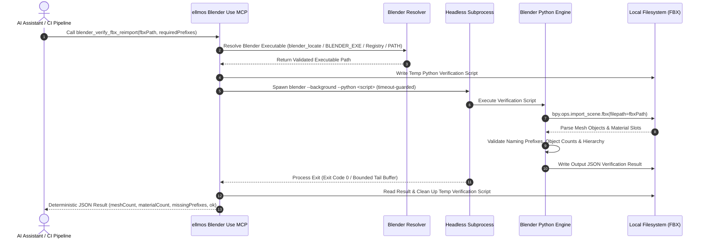

<p align="center">
  
</p>

# ellmos Blender Use MCP

**🇩🇪 [Deutsche Version](README_de.md)**

*Part of the [ellmos-ai](https://github.com/ellmos-ai) family and the [open-bricks](https://github.com/open-bricks) open-source initiative.*

[](https://www.npmjs.com/package/ellmos-blender-use-mcp)
[](https://www.npmjs.com/package/ellmos-blender-use-mcp)
[](https://github.com/ellmos-ai/ellmos-blender-use-mcp/actions/workflows/ci.yml)
[](test/)
[](https://opensource.org/licenses/MIT)
[](https://nodejs.org/)
[](https://github.com/ellmos-ai/ellmos-blender-use-mcp)
[](SECURITY.md)
[](SECURITY.md)
[](SECURITY.md)
[](package.json)
[](llms.txt)
[](https://glama.ai/mcp/servers/@ellmos-ai/ellmos-blender-use-mcp)
[](https://github.com/ellmos-ai)
[](https://github.com/open-bricks)
[](llms.txt)

---

### Quick Navigation

> **Language / Sprache:** 🇬🇧 **English** | 🇩🇪 **[Deutsch](README_de.md)**

[1. Key Capabilities](#key-capabilities) • [2. Architecture & Component Topology](#architecture--workflow) • [3. Headless Verification Lifecycle](#2-headless-asset-qa-verification-lifecycle) • [4. Tool Suite & Verification Matrix](#tools) • [5. Visual Verification Deep Dive](#blender_verify_visual) • [6. CI/CD Integration](#cicd-pipeline-integration) • [7. Governance & Runtime Invariants](#governance--runtime-invariants) • [8. Security Policy](SECURITY.md) • [9. Installation & Setup](#installation) • [10. Configuration & Environment](#configuration) • [11. Third-Party Licenses](THIRD_PARTY_LICENSES.md) • [12. Sibling Projects & Ecosystem](#ellmos-ai-ecosystem) • [13. LLM Context](llms.txt) • [14. Changelog](CHANGELOG.md) • [15. License & Copyright](#license)

---

<a id="key-capabilities"></a>
## Key Capabilities

An asset-QA tool for game and 3D asset pipelines: verify that an exported FBX actually reimports cleanly in headless Blender — mesh count, material count, and required naming prefixes checked automatically, with a deterministic JSON result instead of a manual eyeball pass. `blender_verify_fbx_reimport` is the core structural tool and `blender_verify_visual` its visual counterpart — the first counts meshes and checks name prefixes, the second renders four views and measures geometry that counting cannot see. `blender_locate` and `blender_run_script` are the general-purpose primitives both are built on.

**No add-on. No TCP port. No background daemon.** This server does not install anything into Blender, does not open a socket for a running Blender instance to connect to, and does not keep Blender resident. Each call spawns `blender --background --python <script.py>`, waits for a bounded, timeout-guarded exit, and returns the result — headless and stateless by design. It does not download assets and does not collect telemetry.

**How this differs from other Blender MCP servers.** Most Blender MCP projects (e.g. `ahujasid/blender-mcp`, the official Blender Labs MCP server) drive a *live, running* Blender GUI over a TCP/add-on bridge for interactive scene editing — a different use case with a different trust model (an open socket, an installed add-on, a persistent process). This server instead targets **CI-style, one-shot asset verification**: run it in a pipeline step, get a pass/fail JSON, move on. If you need live GUI control, use a reviewed Blender MCP add-on separately (see Safety below).

> [!NOTE]
> **AI / LLM Integration & Machine-Readable Context**: AI assistants (Claude, Codex, Gemini) can read [llms.txt](llms.txt) for machine-readable context, search phrases, and tool documentation. Regression test suites guard privacy hygiene and runtime memory safety.

> [!TIP]
> **CI & Asset Pipeline Automation**: Use `blender_verify_fbx_reimport` as an automated gate before committing 3D assets to source control. It flags missing prefixes (e.g., `SM_`, `M_`), unexpected mesh counts, or broken material assignments without human intervention.

## Architecture & Workflow

### 1. Component Topology

```mermaid
graph TD
    subgraph Client ["AI Assistant & Client Environment"]
        AI["AI Agent (Claude / Codex / Gemini)"]
        Config["MCP Configuration (npx / node)"]
    end

    subgraph Server ["ellmos Blender Use MCP Server"]
        MCP["MCP Protocol Server (src/index.js)"]
        subgraph Tools ["Tool Handlers"]
            T1["blender_verify_fbx_reimport"]
            T2["blender_run_script"]
            T3["blender_locate"]
            T4["blender_verify_visual"]
        end
        Safety["Timeout & Tail Buffer Guard (8k chars)"]
    end

    subgraph Subprocess ["Headless Subprocess (Isolated)"]
        Exe["Blender Executable (blender --background)"]
        Python["Temp Python Verification Script"]
        FBX["Target FBX Asset File"]
        JSONOut["Deterministic JSON Result"]
    end

    AI -->|JSON-RPC Request| MCP
    MCP --> Tools
    T1 -->|Generates script & spawns| Exe
    T2 -->|Executes arbitrary python| Exe
    T3 -->|Locates binary| Exe
    T4 -->|Generates visual verification script & spawns| Exe
    Exe --> Python
    Python --> FBX
    FBX -->|Mesh / Material / Naming QA| JSONOut
    JSONOut --> Safety
    Safety -->|Bounded Response| AI

    style Client fill:#1e1e2e,stroke:#89b4fa,stroke-width:1px
    style Server fill:#181825,stroke:#cba6f7,stroke-width:1px
    style Subprocess fill:#11111b,stroke:#a6e3a1,stroke-width:1px
```



### 2. Headless Asset-QA Verification Lifecycle



<a id="tools"></a>
## Tools

| Tool | Purpose |
|---|---|
| `blender_verify_fbx_reimport` | Generate a temporary Blender verification script, import an FBX, and write a JSON result with mesh/material counts and missing required prefixes. |
| `blender_run_script` | Run `blender --background --python <script.py>` with optional arguments and bounded stdout tail. |
| `blender_locate` | Resolve the Blender executable from an explicit path, `BLENDER_EXE`, the standard Windows install locations, or PATH. |
| `blender_verify_visual` | Render four views of an FBX and check geometry a structural reimport cannot see: unapplied rotation, floating parts, pivot outside the model, transform residuals, stray empties. |

### `blender_verify_fbx_reimport`

Imports an FBX file into headless Blender and verifies mesh count, empty count, material count, material slot assignments, and required naming prefixes.

#### Parameters

| Parameter | Type | Required | Default | Description |
|---|---|---|---|---|
| `fbxPath` | `string` | **Yes** | — | Target FBX asset file path to verify. |
| `resultPath` | `string` | No | `<fbxDir>/verify_reimport_result.json` | Path where structured JSON verification results will be written. |
| `requiredPrefixes` | `string[]` | No | `[]` | List of naming prefixes required on meshes or empties (e.g. `["SM_", "M_"]`). |
| `blenderPath` | `string` | No | auto-detect | Custom path to the Blender executable (`blender.exe` / `blender`). |
| `timeoutMs` | `number` | No | `120000` | Process execution timeout in milliseconds (max: `600000`). |

#### Example Invocation

```json
{
  "fbxPath": "assets/models/SM_Watchtower_01.fbx",
  "requiredPrefixes": ["SM_", "M_"]
}
```

#### Deterministic Output Schema

```json
{
  "ok": true,
  "blender": "C:\\Program Files\\Blender Foundation\\Blender 4.2\\blender.exe",
  "fbxPath": "C:\\projects\\game\\assets\\models\\SM_Watchtower_01.fbx",
  "resultPath": "C:\\projects\\game\\assets\\models\\verify_reimport_result.json",
  "exitCode": 0,
  "timedOut": false,
  "durationMs": 1820,
  "outputTruncated": false,
  "verification": {
    "ok": true,
    "fbx": "C:\\projects\\game\\assets\\models\\SM_Watchtower_01.fbx",
    "mesh_count": 3,
    "empty_count": 0,
    "material_count": 2,
    "materials": [
      "M_Stone_Brick",
      "M_Wood_Trim"
    ],
    "missing_prefixes": [],
    "script_free": true
  }
}
```

### `blender_verify_visual`

Renders four views of an FBX and checks geometry that a **structural** reimport cannot see.

`blender_verify_fbx_reimport` counts meshes and checks name prefixes — it cannot tell you that
a mesh is lying on its side, that a part floats away from the assembly, or that the pivot sits
outside the model. This tool does, and it produces the renders to look at.

```json
{ "fbxPath": "kit.fbx", "outDir": "verify_visual", "expectHeight": "2.5,3.5" }
```

#### Four-View Orthogonal Projection & Failure Detection

```text
+---------------------------------------+---------------------------------------+
|              TOP VIEW                 |           PERSPECTIVE VIEW            |
|              (XY Plane)               |              (Isometric)              |
|                                       |                                       |
|   Detects: X/Y planar alignment,      |   Detects: Overall silhouette,        |
|   bounding box symmetry, footprint    |   complex assembly integration        |
+---------------------------------------+---------------------------------------+
|             FRONT VIEW                |               SIDE VIEW               |
|              (XZ Plane)               |              (YZ Plane)               |
|                                       |                                       |
|   Detects: Model height, Z-grounding, |   Detects: Depth errors, floating vs  |
|   upright orientation (lying down)    |   resting parts, pivot offset         |
+---------------------------------------+---------------------------------------+
```

Detected failure classes: unapplied rotation, floating parts in multi-part assets, pivot/origin
outside the bounding box, transform residuals in the export, stray empties.

#### Deterministic Output Schema

```json
{
  "ok": true,
  "blender": "C:\\Program Files\\Blender Foundation\\Blender 4.2\\blender.exe",
  "fbxPath": "C:\\projects\\game\\kit.fbx",
  "outDir": "C:\\projects\\game\\verify_visual",
  "exitCode": 0,
  "timedOut": false,
  "durationMs": 3450,
  "outputTruncated": false,
  "verification": {
    "ok": true,
    "fails": [],
    "warns": [],
    "metrics": {
      "dimensions": [2.45, 1.82, 4.10],
      "center": [0.0, 0.0, 2.05],
      "pivotAtOrigin": true,
      "unappliedRotation": false
    }
  },
  "renders": {
    "view_front": "verify_visual/view_front.png",
    "view_side": "verify_visual/view_side.png",
    "view_top": "verify_visual/view_top.png",
    "view_perspective": "verify_visual/view_perspective.png"
  }
}
```

**Why four views and not one:** a single front shot hides depth errors — floating-vs-resting,
behind-vs-in-front. A real case: chain links looked correctly attached from the front and were
not attached at all when seen from the side.

Like every tool here it is a one-shot headless run: no add-on, no daemon, no socket.

<a id="cicd-pipeline-integration"></a>
## CI/CD Pipeline Integration (GitHub Actions)

Integrate headless asset QA directly into your GitHub Actions pull request checks to prevent broken FBX models, missing material slots, unapplied rotations, and displaced pivots from reaching the main branch:

```yaml
name: 3D Asset QA Gate

on:
  pull_request:
    paths:
      - "assets/**/*.fbx"

jobs:
  verify-assets:
    runs-on: ubuntu-latest
    steps:
      - name: Checkout Repository
        uses: actions/checkout@v4

      - name: Install Blender & Node.js
        run: |
          sudo snap install blender --classic
          sudo apt-get install -y nodejs npm

      - name: Run Headless Asset Verification
        run: |
          npx -y ellmos-blender-use-mcp --version
          # Run structural FBX QA and 4-view visual verification
          blender --background --factory-startup --python node_modules/ellmos-blender-use-mcp/scripts/verify_asset_visual.py -- \
            --fbx assets/models/SM_HeroAsset.fbx \
            --out build/asset-qa/ \
            --json
```

## Safety

- This server runs local Python inside Blender. Use only scripts and asset paths you trust.
- The default timeout is bounded.
- No remote asset marketplaces, API keys, or telemetry are included.
- For live GUI control, use a reviewed Blender MCP add-on separately.

<a id="governance--runtime-invariants"></a>
## Governance & Runtime Invariants

The server enforces 10 architectural and runtime invariants to guarantee privacy, safety, process isolation, and auditability:

| ID | Invariant | Guarantee & Implementation Details |
|---|---|---|
| `INV-LOCAL-01` | **100% Local-First & Zero Network Egress** | Zero outbound network requests, external telemetry, or remote API calls. Runs fully air-gapped on the host machine. |
| `INV-HEADLESS-02` | **Stateless & Add-on-Free Headless Execution** | No Blender add-on installation, no open TCP sockets or daemon listeners, and zero mutation of the host Blender user directory. |
| `INV-SEC-03` | **Non-Elevation & Unprivileged RunAsInvoker** | Operates strictly with unprivileged user-mode permissions (`RunAsInvoker`). Never requires or requests administrative elevation. |
| `INV-BOUND-04` | **Strict Timeout & Tail-Buffer Bounding** | Every execution is timeout-guarded. Standard output and error streams are captured into bounded tail buffers (default 8 KB, max 50 KB), preventing runaway memory. |
| `INV-INTEG-05` | **Deterministic JSON & Evidence Integrity** | Produces verifiable, machine-readable JSON reports containing exact mesh counts, material slots, naming prefixes, and geometry metrics. |
| `INV-VISUAL-06` | **Four-View Multi-Angle Visual Verification** | Generates orthogonal front, side, top, and perspective renders to detect geometry defects (floating parts, unapplied rotation) that depth-blind checks miss. |
| `INV-CLEAN-07` | **Fail-Closed Ephemeral Staging & Script Cleanup** | Ephemeral Python verification scripts and temporary staging files are unconditionally purged from the filesystem upon completion or failure. |
| `INV-CROSS-08` | **Cross-Platform Operating System Parity** | Uniform execution and automated discovery across Windows, Linux, and macOS without hardcoded host dependencies. |
| `INV-SYNC-09` | **Cloud-Sync & Multi-Host Lock Discipline** | Resilient against cloud synchronization conflicts (`*-conflict-*`, `*-CONFLIT-*`) and compliant with canonical multi-agent locks. |
| `INV-SLA-10` | **48h Security Response & 5-Day Triage SLA** | Formal vulnerability acknowledgment within 48 hours and triage commitment within 5 business days via official coordination channels. |

<a id="installation"></a>
## Installation

### Option 1: Run via npx (no install)

```json
{
  "mcpServers": {
    "blender-use": {
      "command": "npx",
      "args": ["-y", "ellmos-blender-use-mcp"]
    }
  }
}
```

### Option 2: Install from source

```bash
git clone https://github.com/ellmos-ai/ellmos-blender-use-mcp.git
cd ellmos-blender-use-mcp
npm install
npm run build
node src/index.js
```

For a local checkout, point `command`/`args` at the cloned `src/index.js` instead:

```json
{
  "mcpServers": {
    "blender-use": {
      "command": "node",
      "args": ["<path-to-repo>/src/index.js"]
    }
  }
}
```

<a id="configuration"></a>
## Configuration

- `BLENDER_EXE` — optional path to the Blender executable. Without it, tools try the explicit `blenderPath` argument, then `BLENDER_EXE`, then the standard Blender install locations on Windows (`%ProgramFiles%\Blender Foundation\Blender <version>\blender.exe` and the equivalent 32-bit and per-user roots, newest version first), then `PATH`. On Linux and macOS the lookup goes straight from `BLENDER_EXE` to `PATH`.
- Every tool also accepts an explicit `blenderPath` argument per call, which takes priority over `BLENDER_EXE`.
- Process output is retained only as a tail: `blender_run_script` defaults to 8,000 characters (configurable up to 50,000); FBX verification keeps 8,000. The response marks `outputTruncated: true` when earlier output was discarded, so verbose Blender scripts cannot grow the MCP process memory without bound.

<a id="license"></a>
## License

MIT — see [LICENSE](LICENSE).

---

<a id="ellmos-ai-ecosystem"></a>
## ellmos-ai Ecosystem

This MCP server is part of the **[ellmos-ai](https://github.com/ellmos-ai)** ecosystem — AI infrastructure, MCP servers, and intelligent tools.

### MCP Server Family

| Server | Tools | Focus | npm |
|--------|-------|-------|-----|
| [FileCommander](https://github.com/ellmos-ai/ellmos-filecommander-mcp) | 46 | Filesystem, process management, interactive sessions, cloud-lock-safe operations | [`ellmos-filecommander-mcp`](https://www.npmjs.com/package/ellmos-filecommander-mcp) |
| [CodeCommander](https://github.com/ellmos-ai/ellmos-codecommander-mcp) | 22 | Code analysis, JSON repair, imports, diffs, regex | [`ellmos-codecommander-mcp`](https://www.npmjs.com/package/ellmos-codecommander-mcp) |
| [Clatcher](https://github.com/ellmos-ai/ellmos-clatcher-mcp) | 12 | File repair, format conversion, batch operations | [`ellmos-clatcher-mcp`](https://www.npmjs.com/package/ellmos-clatcher-mcp) |
| [n8n Manager](https://github.com/ellmos-ai/n8n-manager-mcp) | 18 | n8n workflow management via AI assistants | [`n8n-manager-mcp`](https://www.npmjs.com/package/n8n-manager-mcp) |
| [ControlCenter](https://github.com/ellmos-ai/ellmos-controlcenter-mcp) | 20 | MCP stack discovery, profile management, control plane | [`ellmos-controlcenter-mcp`](https://www.npmjs.com/package/ellmos-controlcenter-mcp) |
| [Homebase](https://github.com/ellmos-ai/ellmos-homebase-mcp) | 45 | Local-first LLM memory, knowledge, state, routing, swarm orchestration | [`ellmos-homebase-mcp`](https://www.npmjs.com/package/ellmos-homebase-mcp) (alpha) |
| [ServerCommander](https://github.com/ellmos-ai/ellmos-servercommander-mcp) | 8 | Server operations: health checks, log analysis, deploy dry-runs, mail diagnostics | [`ellmos-servercommander-mcp`](https://www.npmjs.com/package/ellmos-servercommander-mcp) (alpha) |
| **[Blender Use](https://github.com/ellmos-ai/ellmos-blender-use-mcp)** | **4** | **Headless Blender asset QA: structural FBX reimport checks and four-view visual verification** | **[`ellmos-blender-use-mcp`](https://www.npmjs.com/package/ellmos-blender-use-mcp)** (alpha) |
| [Open Compute](https://github.com/ellmos-ai/open-compute-mcp) | 10 | Model-agnostic computer use: capture, safety-gated actions, Windows UIA | [`open-compute-mcp`](https://www.npmjs.com/package/open-compute-mcp) (alpha) |

### AI Infrastructure & Developer Tools

| Project | Description |
|---------|-------------|
| [workflowhooker](https://github.com/ellmos-ai/workflowhooker) | Transparent command interceptor & safety sandbox for agentic workflows |
| [system-explorer](https://github.com/ellmos-ai/system-explorer) | System inspection, MCP orchestration, and fleet introspection runtime |
| [memoryhooker](https://github.com/ellmos-ai/memoryhooker) | High-performance episodic memory interceptor for AI agents |
| [policy-registry](https://github.com/ellmos-ai/policy-registry) | Policy distribution and compliance engine for multi-agent frameworks |
| [ellmos-delegation-authority](https://github.com/ellmos-ai/ellmos-delegation-authority) | Trust boundary verification & cryptographic token delegation authority |
| [sqlite-transit-sync](https://github.com/ellmos-ai/sqlite-transit-sync) | Transactional SQLite transit replication with snapshot isolation |
| [BACH](https://github.com/ellmos-ai/bach) | Local-first text-based OS for LLM agents — 113+ handlers, 550+ tools, SQLite memory |
| [open-compute](https://github.com/ellmos-ai/open-compute) | Model-agnostic computer-use core powering Open Compute MCP |
| [clutch](https://github.com/ellmos-ai/clutch) | Provider-neutral LLM orchestration with auto-routing and budget tracking |
| [rinnsal](https://github.com/ellmos-ai/rinnsal) | Lightweight agent memory, connectors, and automation infrastructure |
| [ellmos-stack](https://github.com/ellmos-ai/ellmos-stack) | Self-hosted AI research stack (Ollama + n8n + Rinnsal + KnowledgeDigest) |
| [MarbleRun](https://github.com/ellmos-ai/MarbleRun) | Autonomous agent chain framework for Claude Code |
| [gardener](https://github.com/ellmos-ai/gardener) | Minimalist database-driven LLM OS prototype (4 functions, 1 table) |
| [ellmos-tests](https://github.com/ellmos-ai/ellmos-tests) | Testing framework for LLM operating systems (7 dimensions) |

### Desktop Software Suite & Sibling Tools

Our partner organization **[open-bricks](https://github.com/open-bricks)** bundles AI-native desktop applications and developer utilities — a modern, open-source software suite built for the age of AI:

| Project | Ecosystem | Description |
|---------|-----------|-------------|
| [ProFiler](https://github.com/file-bricks/ProFiler) | `file-bricks` | Advanced file management, deep inspection, and batch pipeline workbench |
| [DokuZen](https://github.com/doc-bricks/DokuZen) | `doc-bricks` | Unified document converter, markdown formatter, and documentation hub |
| [PDFtoPDFocr](https://github.com/doc-bricks/PDFtoPDFocr) | `doc-bricks` | High-fidelity OCR processor and searchable PDF pipeline |
| [FormularErstellen](https://github.com/doc-bricks/FormularErstellen) | `doc-bricks` | Declarative form generator and PDF schema compiler |
| [MediaBrain](https://github.com/file-bricks/MediaBrain) | `file-bricks` | AI-assisted media categorization, tagging, and asset management |
| [TextBrain](https://github.com/doc-bricks/TextBrain) | `doc-bricks` | Text analysis, summarization, and local language intelligence suite |
| [knowledgedigest](https://github.com/open-bricks/knowledgedigest) | `open-bricks` | Knowledge extraction, semantic clustering, and synthesis engine |
| [DevCenter](https://github.com/dev-bricks/DevCenter) | `dev-bricks` | Developer environment orchestration and multi-agent management cockpit |
| [CodeBox](https://github.com/dev-bricks/CodeBox) | `dev-bricks` | Secure execution sandbox and isolated code-runner runtime |
| [BattleStage](https://github.com/entertain-and-more/BattleStage) | `entertain-and-more` | Modular tactical game arena with automated asset pipeline validation |
