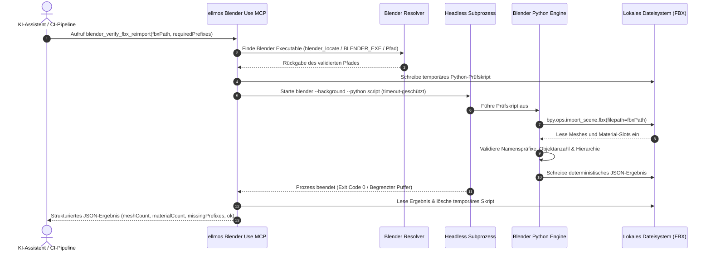

<p align="center">
  
</p>

# ellmos Blender Use MCP

**🇬🇧 [English version](README.md)**

*Teil der [ellmos-ai](https://github.com/ellmos-ai)-Familie und der Open-Source-Initiative [open-bricks](https://github.com/open-bricks).*

[](https://www.npmjs.com/package/ellmos-blender-use-mcp)
[](https://www.npmjs.com/package/ellmos-blender-use-mcp)
[](https://github.com/ellmos-ai/ellmos-blender-use-mcp/actions/workflows/ci.yml)
[](test/)
[](https://opensource.org/licenses/MIT)
[](NOTICE)
[](https://nodejs.org/)
[](https://github.com/ellmos-ai/ellmos-blender-use-mcp)
[](SECURITY.md)
[](SECURITY.md)
[](SECURITY.md)
[](package.json)
[](llms.txt)
[](https://glama.ai/mcp/servers/@ellmos-ai/ellmos-blender-use-mcp)
[](https://github.com/ellmos-ai)
[](https://github.com/open-bricks)
[](llms.txt)

---

### Schnellnavigation

> **Sprache / Language:** 🇩🇪 **Deutsch** | 🇬🇧 **[English](README.md)**

[1. Kernfähigkeiten](#kernfaehigkeiten) • [2. Zielgruppen & Auffindbarkeit](#zielgruppen--auffindbarkeit) • [3. Vergleichsmatrix](#vergleichsmatrix-gegenueber-alternativen) • [4. Architektur & Topologie](#architektur--workflow) • [5. Verifikations-Lebenszyklus](#headless-verifikations-lebenszyklus) • [6. Werkzeugpalette](#werkzeuge) • [7. FBX-Verifikation im Detail](#blender_verify_fbx_reimport-de) • [8. Visuelle Prüfung im Detail](#blender_verify_visual-de) • [9. Basis-Werkzeuge](#allgemeine-basis-werkzeuge) • [10. CI/CD-Integration](#cicd-pipeline-integration-de) • [11. Governance-Invarianten](#governance--laufzeit-invarianten) • [12. Sicherheitsrichtlinie](SECURITY.md) • [13. Installation](#installation-de) • [14. Konfiguration](#konfiguration-de) • [15. Level 1 SBOM](THIRD_PARTY_LICENSES.md) • [16. Ökosystem](#ellmos-ai-oekosystem) • [17. LLM-Kontext](llms.txt) • [18. Lizenz & Haftungsausschluss](#lizenz--haftungsausschluss)

---

<a id="key-capabilities"></a>
<a id="kernfaehigkeiten"></a>
## 1. Kernfähigkeiten

Ein Asset-QA-Werkzeug für Game- und 3D-Asset-Pipelines: prüft, ob eine exportierte FBX-Datei im headless Blender tatsächlich sauber re-importiert — Mesh-Anzahl, Material-Anzahl und geforderte Namens-Präfixe werden automatisch geprüft, mit einem deterministischen JSON-Ergebnis statt einer manuellen Sichtprüfung. `blender_verify_fbx_reimport` ist das strukturelle Kern-Tool und `blender_verify_visual` sein visuelles Gegenstück — das erste zählt Meshes und prüft Namenspräfixe, das zweite rendert vier Ansichten und misst Geometrie, die eine reine Zählung nicht erfassen kann. `blender_locate` und `blender_run_script` sind die allgemeinen Bausteine, auf denen beide aufbauen.

**Kein Add-on. Kein TCP-Port. Kein Hintergrund-Daemon.** Dieser Server installiert nichts in Blender, öffnet keinen Socket für eine laufende Blender-Instanz und hält Blender nicht dauerhaft im Speicher. Jeder Aufruf startet `blender --background --python <script.py>`, wartet auf ein zeitlich begrenztes, timeout-geschütztes Ende und gibt das Ergebnis zurück — headless und zustandslos per Design. Es werden keine Assets heruntergeladen und keine Telemetrie erfasst.

**Abgrenzung zu anderen Blender-MCP-Servern.** Die meisten Blender-MCP-Projekte (z. B. `ahujasid/blender-mcp`, der offizielle Blender-Labs-MCP-Server) steuern eine *laufende* Blender-GUI live über eine TCP-/Add-on-Brücke für interaktive Szenenbearbeitung — ein anderer Anwendungsfall mit einem anderen Vertrauensmodell (ein offener Socket, ein installiertes Add-on, ein dauerhaft laufender Prozess). Dieser Server zielt stattdessen auf **CI-artige, einmalige Asset-Verifikation**: in einem Pipeline-Schritt ausführen, ein Pass/Fail-JSON erhalten, weitermachen. Wer live GUI-Kontrolle braucht, nutzt dafür separat ein geprüftes Blender-MCP-Add-on (siehe Sicherheit unten).

> [!NOTE]
> **KI / LLM Integration & Maschinenlesbarer Kontext**: KI-Assistenten (Claude, Codex, Gemini) können [llms.txt](llms.txt) für maschinenlesbaren Kontext, Suchphrasen und Werkzeug-Dokumentation auslesen. Regressions-Test-Suiten sichern Datenschutz-Hygiene und Laufzeit-Speichersicherheit.

> [!TIP]
> **CI & Asset-Pipeline-Automatisierung**: Nutzen Sie `blender_verify_fbx_reimport` als automatisiertes Release-Gate vor dem Commit von 3D-Assets in die Versionsverwaltung. Es meldet fehlende Namenspräfixe (z. B. `SM_`, `M_`), unerwartete Mesh-Anzahlen oder fehlerhafte Materialzuweisungen ohne manuellen Eingriff.

---

<a id="target-personas--discoverability"></a>
<a id="zielgruppen--auffindbarkeit"></a>
## 2. Zielgruppen & Auffindbarkeit

### [PERSONA-01] Indie- & AAA-Game Technical Artists & 3D-Pipeline TDs
- **Profil:** Technical Artists, die FBX/GLTF-Asset-Pipelines für Unreal Engine, Unity, Godot oder eigene Game-Engines betreuen.
- **Problem:** Exportierte 3D-Modelle weisen häufig unvollständige Rotationen auf (liegen auf der Seite im Spiel), besitzen versetzte Drehpunkte, fehlende Präfixe (`SM_`, `M_`) oder nicht zugewiesene Materialien.
- **Suchbegriffe:** `blender fbx reimport verification mcp`, `blender headless asset qa gate`, `automated fbx naming convention check`, `detect unapplied rotation fbx blender`.
- **Lösung:** Vollautomatische strukturelle Reimport-Prüfung und 4-Ansichten-Geometrieprüfung ohne Start der grafischen Blender-Oberfläche.

### [PERSONA-02] CI/CD-Automations- & Build-Infrastruktur-Ingenieure
- **Profil:** DevOps- und Build-Ingenieure, die automatisierte Prüfschranken in GitHub Actions, GitLab CI oder Jenkins etablieren.
- **Problem:** Bestehende Blender-Tools erfordern GUI-Add-ons oder Hintergrund-Sockets, die in containerisierten CI-Runnern fehlschlagen.
- **Suchbegriffe:** `headless blender asset qa mcp server`, `github actions blender fbx qa gate`, `blender background script ci cd verification`, `blender mcp no add-on no tcp port`.
- **Lösung:** Zustandsloser `blender --background`-Lauf mit 15-Minuten-Timeout-Schranke, 8-KB-Pufferbegrenzung, null Add-ons und deterministischen JSON-Ausgaben.

### [PERSONA-03] Autonome KI-Agenten-Entwickler (Claude, Codex, Gemini)
- **Profil:** Entwickler von KI-Coding-Agenten für prozedurale 3D-Generierung, Asset-Verarbeitung und Prototyping.
- **Problem:** Agenten benötigen verlässliche 3D-Modellprüfungen ohne Socket-Lecks, Zombie-Prozesse oder Speicherwachstum.
- **Suchbegriffe:** `mcp server fbx mesh material verification`, `ai agent blender 3d asset inspection`, `blender four-view rendering mcp`, `llm tool headless blender`.
- **Lösung:** Natives Model Context Protocol (MCP) mit strukturierter [llms.txt](llms.txt), Prozessbaum-Terminierung (`taskkill /T /F`) und rückstandsloser Bereinigung.

### [PERSONA-04] Compliance- & Sicherheitsverantwortliche in Spielestudios
- **Profil:** Sicherheitsbeauftragte, die firmeneigenes geistiges Eigentum (IP) und Workstations vor Datenabfluss schützen.
- **Problem:** Externe DCC-Werkzeuge öffnen Netzwerkports, senden Telemetrie oder verlangen Administrationsrechte.
- **Suchbegriffe:** `offline blender mcp zero egress`, `air gapped 3d asset verification`, `unprivileged blender asset qa`, `zero copyleft mcp tool`.
- **Lösung:** Zertifizierte unprivilegierte `RunAsInvoker`-Ausführung, 100% Offline-Betrieb ohne Netzwerkverbindungen und 0% Copyleft-Lizenzen im Level 1 SBOM.

---

<a id="comparative-matrix-vs-alternatives"></a>
<a id="vergleichsmatrix-gegenueber-alternativen"></a>
## 3. 10-Dimensionen-Vergleichsmatrix gegenüber Alternativen

| Invariante / Dimension | [1] `ellmos-blender-use-mcp` | [2] Interaktives Blender MCP (TCP-Add-on) | [3] Ad-Hoc Python Skripte | [4] Schwere DCC-Suiten (Maya / 3ds Max) | [5] Cloud SaaS 3D-Prüfer (Sketchfab) |
|---|---|---|---|---|---|
| **INV-LOCAL-01: Offline & Air-Gap** | **100% Offline / Zero-Egress** (0 Netzwerkaufrufe) | Erfordert lokalen TCP-Socket-Port | Lokal, aber unkontrollierter Netzzugriff | Schweres Polling von Lizenzservern | SaaS-Upload erforderlich (Datenabfluss-Risiko) |
| **INV-HEADLESS-02: Add-on-Freiheit** | **Null Add-ons** (funktioniert sofort) | Erfordert Installation von Add-ons | Kein Add-on nötig | Proprietäre Plugins erforderlich | Web-Browser oder Client-Upload |
| **INV-SEC-03: Rechte-Modell** | **Unprivilegiertes RunAsInvoker** (Benutzermodus) | Benutzermodus, aber offene Angriffsfläche | Unbeschränkte Skriptausführung | Benötigt Administrationsrechte | Cloud-Sicherheitsgrenze |
| **INV-BOUND-04: Speicher-Grenzen** | **Fester Tail-Puffer (8 KB - 50 KB max)** | Unbegrenzter GUI-Speicherverbrauch | Unbegrenzte Terminal-Ausgaben | Sehr hoher Speicherbedarf | Cloud-Verarbeitungskontingente |
| **INV-INTEG-05: Strukturiertes JSON** | **Deterministisches maschinenlesbares JSON** | Freitext im Chat-Fenster | Unstrukturierte Konsolenausgaben | Proprietäre XML-/Logberichte | Visualisierung im Web-Dashboard |
| **INV-VISUAL-06: 4-Ansichten-Prüfung**| **Standardisierte 4-Ansichten-Renders** | Manuelles Drehen im Ansichtsfenster | Erfordert eigene Kamera-Skripte | Manuelle Navigation im Viewport | Einzelner WebGL-Modellbetrachter |
| **INV-CLEAN-07: Bereinigung** | **Automatisches Löschen aller Temp-Dateien** | Verbleibender Szenenstatus im RAM | Verwaiste Hilfsskripte (.py/.blend) | Große temporäre Projektverzeichnisse | Speicherung auf Cloud-Servern |
| **INV-CROSS-08: Plattform-Parität** | **Windows, Linux & macOS Parität** | Abhängig von GUI-Desktop-Treibern | Betriebssystem-abhängige Pfade | Meist auf Windows beschränkt | Plattformunabhängiger Browser |
| **INV-SYNC-09: Sync- & Sperrschutz** | **Schutz vor Dateikonflikten & Sperren** | Anfällig für Schreibkonflikte | Keine Sperrdatei-Erkennung | Proprietäre Dateisperren | Keine Multi-Device-Git-Disziplin |
| **INV-SLA-10: Sicherheits-SLA** | **48h Antwort- & 5-Tage-Triage-Zusage** | Reiner Community-Support (kein SLA) | Kein formeller Support | Teure Enterprise-Supportverträge | Standard-Ticket-Warteschlange |

---

<a id="architecture--workflow"></a>
<a id="architektur--workflow"></a>
## 4. Architektur & Komponenten-Topologie

```mermaid
graph TD
    subgraph Client ["KI-Assistent & Client-Umgebung"]
        AI["KI-Agent (Claude / Codex / Gemini)"]
        Config["MCP-Konfiguration (npx / node)"]
    end

    subgraph Server ["ellmos Blender Use MCP Server"]
        MCP["MCP-Protokoll-Server (src/index.js)"]
        subgraph Tools ["Tool-Handler"]
            T1["blender_verify_fbx_reimport"]
            T2["blender_run_script"]
            T3["blender_locate"]
            T4["blender_verify_visual"]
        end
        Safety["Timeout & Tail-Puffer-Schutz (8k Zeichen)"]
    end

    subgraph Subprocess ["Headless Subprozess (Isoliert)"]
        Exe["Blender Executable (blender --background)"]
        Python["Temp Python Verifikations-Skript"]
        FBX["Ziel FBX-Asset-Datei"]
        JSONOut["Deterministisches JSON-Ergebnis"]
    end

    AI -->|JSON-RPC Anfrage| MCP
    MCP --> Tools
    T1 -->|Generiert Skript & startet| Exe
    T2 -->|Führt beliebiges Python aus| Exe
    T3 -->|Sucht Executable| Exe
    T4 -->|Generiert visuelles Verifikationsskript & startet| Exe
    Exe --> Python
    Python --> FBX
    FBX -->|Mesh / Material / Namens-QA| JSONOut
    JSONOut --> Safety
    Safety -->|Begrenzte Antwort| AI

    style Client fill:#1e1e2e,stroke:#89b4fa,stroke-width:1px
    style Server fill:#181825,stroke:#cba6f7,stroke-width:1px
    style Subprocess fill:#11111b,stroke:#a6e3a1,stroke-width:1px
```



---

<a id="headless-verification-lifecycle"></a>
<a id="headless-verifikations-lebenszyklus"></a>
## 5. Headless Verifikations-Lebenszyklus



---

<a id="tools"></a>
<a id="werkzeuge"></a>
## 6. Werkzeugpalette & Verifikations-Matrix

| Werkzeug | Zweck | Hauptausgabe | Speicherschutz |
|---|---|---|---|
| `blender_verify_fbx_reimport` | Erzeugt temporäres Prüfskript, importiert FBX und liefert deterministisches JSON mit Mesh-/Material-Zählung und fehlenden Präfixen. | JSON-Bericht | Fester 8-KB-Puffer |
| `blender_verify_visual` | Rendert vier Ansichten einer FBX-Datei und prüft Geometrie: falsche Rotationen, schwebende Teile, versetzte Drehpunkte, Skalierungsreste. | 4 PNGs + JSON | Fester 8-KB-Puffer |
| `blender_run_script` | Führt `blender --background --python <skript.py>` mit Parametern und begrenztem Ausgabepuffer aus. | Textauszug | 8 KB - 50 KB max |
| `blender_locate` | Löst den Pfad zur Blender-Installation über Parameter, `BLENDER_EXE`, Standardverzeichnisse oder PATH auf. | Pfadangabe | Kein Subprozess |

---

<a id="blender_verify_fbx_reimport"></a>
<a id="blender_verify_fbx_reimport-de"></a>
## 7. `blender_verify_fbx_reimport` im Detail & Schema

Importiert eine FBX-Datei in headless Blender und verifiziert Mesh-Zahl, Empties, Materialanzahl, Slot-Zuweisungen und Namenspräfixe.

### Aufrufparameter

| Parameter | Typ | Erforderlich | Standardwert | Beschreibung |
|---|---|---|---|---|
| `fbxPath` | `string` | **Ja** | — | Pfad zur zu prüfenden FBX-Datei. |
| `resultPath` | `string` | Nein | `<fbxDir>/verify_reimport_result.json` | Pfad für die strukturierte JSON-Ausgabe. |
| `requiredPrefixes` | `string[]` | Nein | `[]` | Liste geforderter Namenspräfixe (z. B. `["SM_", "M_"]`). |
| `blenderPath` | `string` | Nein | automatische Erkennung | Expliziter Pfad zur Blender-Ausführungsdatei. |
| `timeoutMs` | `number` | Nein | `120000` | Timeout in Millisekunden (maximal: `600000`). |

### Beispielaufruf

```json
{
  "fbxPath": "assets/models/SM_Watchtower_01.fbx",
  "requiredPrefixes": ["SM_", "M_"]
}
```

### Deterministisches Ausgabeschema

```json
{
  "ok": true,
  "blender": "C:\\Program Files\\Blender Foundation\\Blender 4.2\\blender.exe",
  "fbxPath": "C:\\projects\\game\\assets\\models\\SM_Watchtower_01.fbx",
  "resultPath": "C:\\projects\\game\\assets\\models\\verify_reimport_result.json",
  "exitCode": 0,
  "timedOut": false,
  "durationMs": 1820,
  "outputTruncated": false,
  "verification": {
    "ok": true,
    "fbx": "C:\\projects\\game\\assets\\models\\SM_Watchtower_01.fbx",
    "mesh_count": 3,
    "empty_count": 0,
    "material_count": 2,
    "materials": [
      "M_Stone_Brick",
      "M_Wood_Trim"
    ],
    "missing_prefixes": [],
    "script_free": true
  }
}
```

---

<a id="blender_verify_visual"></a>
<a id="blender_verify_visual-de"></a>
## 8. Visuelle Prüfung im Detail & 4-Ansichten-Geometrie

Rendert vier Ansichten einer FBX-Datei und erkennt geometrische Fehler, die eine **strukturelle** Prüfung nicht erfassen kann.

`blender_verify_fbx_reimport` zählt Meshes und validiert Namenspräfixe — es kann jedoch nicht erkennen, ob ein Objekt auf der Seite liegt, Teile abgetrennt im Raum schweben oder der Drehpunkt außerhalb des Modells liegt. Dieses Werkzeug erzeugt standardisierte Renderings und vermisst die Bounding-Box.

```json
{ "fbxPath": "kit.fbx", "outDir": "verify_visual", "expectHeight": "2.5,3.5" }
```

### Orthogonale 4-Ansichten-Projektion & Fehlererkennung

```text
+---------------------------------------+---------------------------------------+
|            DRAUFSICHT (TOP)           |             PERSPEKTIVE               |
|               (XY-Ebene)              |             (Isometrisch)             |
|                                       |                                       |
|   Erkennt: X/Y-Ausrichtung,           |   Erkennt: Gesamtsilhouette,          |
|   Symmetrie, Grundfläche              |   Zusammenbau komplexer Bauteile      |
+---------------------------------------+---------------------------------------+
|             FRONTANSICHT              |             SEITENANSICHT             |
|               (XZ-Ebene)              |               (YZ-Ebene)              |
|                                       |                                       |
|   Erkennt: Objekthöhe, Z-Bodenhaftung,|   Erkennt: Tiefenfehler, schwebende   |
|   aufrechte Ausrichtung               |   Teile, Drehpunkt-Verschiebungen     |
+---------------------------------------+---------------------------------------+
```

Erkannte Fehlerklassen: nicht angewendete Rotationen, abgetrennte Teilobjekte in Mehrteilern, Drehpunkt außerhalb der Geometrie, unbereinigte Transformationsreste beim Export, herrenlose Hilfsobjekte.

### Deterministisches Ausgabeschema

```json
{
  "ok": true,
  "blender": "C:\\Program Files\\Blender Foundation\\Blender 4.2\\blender.exe",
  "fbxPath": "C:\\projects\\game\\kit.fbx",
  "outDir": "C:\\projects\\game\\verify_visual",
  "exitCode": 0,
  "timedOut": false,
  "durationMs": 3450,
  "outputTruncated": false,
  "verification": {
    "ok": true,
    "fails": [],
    "warns": [],
    "metrics": {
      "dimensions": [2.45, 1.82, 4.10],
      "center": [0.0, 0.0, 2.05],
      "pivotAtOrigin": true,
      "unappliedRotation": false
    }
  },
  "renders": {
    "view_front": "verify_visual/view_front.png",
    "view_side": "verify_visual/view_side.png",
    "view_top": "verify_visual/view_top.png",
    "view_perspective": "verify_visual/view_perspective.png"
  }
}
```

---

<a id="general-purpose-primitives"></a>
<a id="allgemeine-basis-werkzeuge"></a>
## 9. Allgemeine Basis-Werkzeuge (`blender_locate` & `blender_run_script`)

- `blender_locate`: Findet die ausführbare Datei auf Windows, Linux oder macOS über Aufrufparameter, Umgebungsvariable `BLENDER_EXE`, Standardverzeichnisse (neueste Version zuerst) oder `PATH`.
- `blender_run_script`: Führt ein beliebiges lokales Python-Skript via `blender --background --python <skript.py>` aus, inklusive Parametern, Timeout-Überwachung und Pufferbegrenzung (Standard: 8 KB, bis 50 KB konfigurierbar).

---

<a id="cicd-pipeline-integration"></a>
<a id="cicd-pipeline-integration-de"></a>
## 10. CI/CD-Pipeline-Integration (GitHub Actions)

Integrieren Sie automatisierte Asset-Prüfungen direkt in GitHub Actions Pull Requests, um fehlerhafte Geometrien oder fehlende Materialzuweisungen vor dem Merge abzufangen:

```yaml
name: 3D Asset QA Gate

on:
  pull_request:
    paths:
      - "assets/**/*.fbx"

jobs:
  verify-assets:
    runs-on: ubuntu-latest
    steps:
      - name: Checkout Repository
        uses: actions/checkout@v4

      - name: Install Blender & Node.js
        run: |
          sudo snap install blender --classic
          sudo apt-get install -y nodejs npm

      - name: Run Headless Asset Verification
        run: |
          npx -y ellmos-blender-use-mcp --version
          # Führe FBX-QA und 4-Ansichten-Prüfung aus
          blender --background --factory-startup --python node_modules/ellmos-blender-use-mcp/scripts/verify_asset_visual.py -- \
            --fbx assets/models/SM_HeroAsset.fbx \
            --out build/asset-qa/ \
            --json
```

---

<a id="governance--runtime-invariants"></a>
<a id="governance--laufzeit-invarianten"></a>
## 11. Governance & Laufzeit-Invarianten

Der Server setzt 10 Architektur- und Laufzeit-Invarianten durch:

| ID | Invariante | Garantie & technische Umsetzung |
|---|---|---|
| `INV-LOCAL-01` | **100% Local-First & Zero Network Egress** | Keine ausgehenden Netzwerkaufrufe, keine Telemetrie. Vollständiger Offline-Betrieb. |
| `INV-HEADLESS-02` | **Stateless & Add-on-Free Headless Execution** | Keine Add-on-Installation, keine offenen TCP-Ports, keine dauerhaften Hintergrundprozesse. |
| `INV-SEC-03` | **Non-Elevation & Unprivileged RunAsInvoker** | Läuft ausschließlich mit Standard-Benutzerrechten. Keine Administrator-Rechte erforderlich. |
| `INV-BOUND-04` | **Strict Timeout & Tail-Buffer Bounding** | Jeder Lauf ist zeitlich begrenzt. Standard- und Fehlerausgaben werden auf 8 KB begrenzt. |
| `INV-INTEG-05` | **Deterministic JSON & Evidence Integrity** | Liefert strukturierte, maschinenlesbare JSON-Prüfberichte mit genauen Messwerten. |
| `INV-VISUAL-06` | **Four-View Multi-Angle Visual Verification** | Erzeugt frontale, seitliche, obere und perspektivische Renderings zur Tiefenprüfung. |
| `INV-CLEAN-07` | **Fail-Closed Ephemeral Staging & Script Cleanup** | Temporäre Python-Skripte werden nach Prozessende ausnahmslos gelöscht. |
| `INV-CROSS-08` | **Cross-Platform Operating System Parity** | Einheitliche Funktion auf Windows, Linux und macOS ohne feste Betriebssystembindung. |
| `INV-SYNC-09` | **Cloud-Sync & Multi-Host Lock Discipline** | Resistent gegen Cloud-Synchronisationskonflikte und kompatibel mit Multi-Agenten-Sperren. |
| `INV-SLA-10` | **48h Security Response & 5-Day Triage SLA** | Bestätigung von Sicherheitsmeldungen binnen 48 Stunden und Triage innerhalb von 5 Werktagen. |

---

<a id="security-policy"></a>
<a id="sicherheitsrichtlinie"></a>
## 12. Sicherheitsrichtlinie & RunAsInvoker

- **Lokale Ausführung**: Der Server führt lokalen Python-Code in Blender aus. Verwenden Sie nur vertrauenswürdige Skripte und Asset-Dateien.
- **RunAsInvoker-Prinzip**: Funktioniert im unprivilegierten Standard-Benutzerkonto; verlangt keinerlei Administrator-Rechte.
- **Prozessbereinigung**: Windows-Prozessbäume werden bei Zeitüberschreitung sauber über `taskkill /pid <PID> /T /F` beendet.
- **Offline-Garantie**: Keine Verbindung zu Asset-Stores, externen Schnittstellen oder Telemetrie-Diensten.
- **Schwachstellenmeldung**: In [SECURITY.md](SECURITY.md) finden Sie Kontaktmöglichkeiten und unsere verbindliche 48-Stunden-Reaktionsfrist.

---

<a id="installation"></a>
<a id="installation-de"></a>
## 13. Installation & Erste Schritte

### Variante 1: Direkt via npx (ohne Installation)

```json
{
  "mcpServers": {
    "blender-use": {
      "command": "npx",
      "args": ["-y", "ellmos-blender-use-mcp"]
    }
  }
}
```

### Variante 2: Aus dem Quellcode installieren

```bash
git clone https://github.com/ellmos-ai/ellmos-blender-use-mcp.git
cd ellmos-blender-use-mcp
npm install
npm run build
node src/index.js
```

Für eine lokale Einbindung verweisen Sie in der Konfiguration direkt auf die geklonte `src/index.js`:

```json
{
  "mcpServers": {
    "blender-use": {
      "command": "node",
      "args": ["<pfad-zum-repo>/src/index.js"]
    }
  }
}
```

---

<a id="configuration"></a>
<a id="konfiguration-de"></a>
## 14. Konfiguration & Umgebungsvariablen

- `BLENDER_EXE` — optionaler Pfad zur Blender-Ausführungsdatei. Ohne Angabe prüfen die Werkzeuge den `blenderPath`-Parameter, danach `BLENDER_EXE`, dann die Standard-Installationspfade unter Windows (`%ProgramFiles%\Blender Foundation\Blender <version>\blender.exe`, neueste Version zuerst) und schließlich den System-`PATH`. Unter Linux und macOS erfolgt die Suche direkt über `BLENDER_EXE` und `PATH`.
- Jedes Werkzeug akzeptiert einen expliziten Parameter `blenderPath`, der Vorrang vor Umgebungsvariablen hat.
- Der Ausgabepuffer ist strikt begrenzt: `blender_run_script` nutzt standardmäßig 8.000 Zeichen (konfigurierbar bis 50.000); FBX-Prüfungen halten 8.000 Zeichen im Speicher. Bei Überschreitungen wird `outputTruncated: true` zurückgegeben.

---

<a id="third-party-licenses--level-1-sbom"></a>
<a id="drittanbieter-lizenzen--level-1-sbom"></a>
## 15. Drittanbieter-Lizenzen & Level 1 SBOM

Alle Laufzeit-Abhängigkeiten stehen unter permissiven Open-Source-Lizenzen (MIT und BSD-2-Clause) mit 0% Copyleft:
- `@modelcontextprotocol/sdk` (MIT)
- `update-notifier` (BSD-2-Clause)
- `zod` (MIT)

Eine vollständige Übersicht inklusive Invarianten-Matrix und Isolation externer Konzepte finden Sie in [THIRD_PARTY_LICENSES.md](THIRD_PARTY_LICENSES.md).

---

<a id="ellmos-ai-ecosystem"></a>
<a id="ellmos-ai-oekosystem"></a>
## 16. Geschwisterprojekte & ellmos-ai Ökosystem

Dieser MCP-Server ist Bestandteil des **[ellmos-ai](https://github.com/ellmos-ai)**-Ökosystems — KI-Infrastruktur, MCP-Server und intelligente Werkzeuge.

### MCP-Server-Familie

| Server | Werkzeuge | Schwerpunkt | npm |
|--------|-----------|-------------|-----|
| [FileCommander](https://github.com/ellmos-ai/ellmos-filecommander-mcp) | 46 | Dateisystem, Prozessverwaltung, interaktive Sitzungen, sperrsichere Abläufe | [`ellmos-filecommander-mcp`](https://www.npmjs.com/package/ellmos-filecommander-mcp) |
| [CodeCommander](https://github.com/ellmos-ai/ellmos-codecommander-mcp) | 22 | Code-Analyse, JSON-Reparatur, Imports, Diffs, Regex | [`ellmos-codecommander-mcp`](https://www.npmjs.com/package/ellmos-codecommander-mcp) |
| [Clatcher](https://github.com/ellmos-ai/ellmos-clatcher-mcp) | 12 | Dateireparatur, Formatkonvertierung, Stapelverarbeitung | [`ellmos-clatcher-mcp`](https://www.npmjs.com/package/ellmos-clatcher-mcp) |
| [n8n Manager](https://github.com/ellmos-ai/n8n-manager-mcp) | 18 | n8n-Workflow-Management über KI-Assistenten | [`n8n-manager-mcp`](https://www.npmjs.com/package/n8n-manager-mcp) |
| [ControlCenter](https://github.com/ellmos-ai/ellmos-controlcenter-mcp) | 20 | MCP-Stack-Erkennung, Profil-Management, Steuerungsebene | [`ellmos-controlcenter-mcp`](https://www.npmjs.com/package/ellmos-controlcenter-mcp) |
| [Homebase](https://github.com/ellmos-ai/ellmos-homebase-mcp) | 45 | Lokales LLM-Gedächtnis, Wissensnetze, Routing, Schwarm-Steuerung | [`ellmos-homebase-mcp`](https://www.npmjs.com/package/ellmos-homebase-mcp) (alpha) |
| [ServerCommander](https://github.com/ellmos-ai/ellmos-servercommander-mcp) | 8 | Server-Betrieb: Zustandsprüfungen, Log-Analyse, Test-Bereitstellung | [`ellmos-servercommander-mcp`](https://www.npmjs.com/package/ellmos-servercommander-mcp) (alpha) |
| **[Blender Use](https://github.com/ellmos-ai/ellmos-blender-use-mcp)** | **4** | **Headless Blender Asset-QA: FBX-Reimport-Prüfung und 4-Ansichten-Verifikation** | **[`ellmos-blender-use-mcp`](https://www.npmjs.com/package/ellmos-blender-use-mcp)** (alpha) |
| [Open Compute](https://github.com/ellmos-ai/open-compute-mcp) | 10 | Modellagnostische Computer-Nutzung: Screenshot-Erfassung, Windows UIA | [`open-compute-mcp`](https://www.npmjs.com/package/open-compute-mcp) (alpha) |

### KI-Infrastruktur & Entwickler-Werkzeuge

| Projekt | Beschreibung |
|---------|--------------|
| [workflowhooker](https://github.com/ellmos-ai/workflowhooker) | Befehls-Interceptor und Sicherheits-Sandbox für KI-Workflows |
| [system-explorer](https://github.com/ellmos-ai/system-explorer) | System-Inspektion, MCP-Orchestrierung und Flotten-Introspektion |
| [memoryhooker](https://github.com/ellmos-ai/memoryhooker) | Leistungsfähiger episodischer Speicher-Interceptor für Agenten |
| [policy-registry](https://github.com/ellmos-ai/policy-registry) | Richtlinien-Verteilung und Compliance für Multi-Agenten-Systeme |
| [ellmos-delegation-authority](https://github.com/ellmos-ai/ellmos-delegation-authority) | Vertrauensgrenzen-Prüfung und kryptografische Delegierung |
| [sqlite-transit-sync](https://github.com/ellmos-ai/sqlite-transit-sync) | Transaktionale SQLite-Replikation mit Snapshot-Isolation |
| [BACH](https://github.com/ellmos-ai/bach) | Lokales textbasiertes Betriebssystem für LLM-Agenten |
| [open-compute](https://github.com/ellmos-ai/open-compute) | Modellagnostischer Computer-Use-Kern |
| [clutch](https://github.com/ellmos-ai/clutch) | Provider-neutrales LLM-Routing mit Budget-Überwachung |
| [rinnsal](https://github.com/ellmos-ai/rinnsal) | Leichtgewichtige Agenten-Infrastruktur und Schnittstellen |
| [ellmos-stack](https://github.com/ellmos-ai/ellmos-stack) | Selbstgehosteter KI-Stack (Ollama + n8n + Rinnsal + KnowledgeDigest) |
| [MarbleRun](https://github.com/ellmos-ai/MarbleRun) | Autonomes Agentenketten-Framework für Claude Code |
| [gardener](https://github.com/ellmos-ai/gardener) | Minimalistischer datenbankgestützter LLM-Betriebssystem-Prototyp |
| [ellmos-tests](https://github.com/ellmos-ai/ellmos-tests) | Testframework für LLM-Betriebssysteme |

### Desktop-Software-Suite & Geschwister-Werkzeuge

Unsere Partner-Organisation **[open-bricks](https://github.com/open-bricks)** bündelt KI-native Desktop-Programme und Entwickler-Tools:

| Projekt | Ökosystem | Beschreibung |
|---------|-----------|--------------|
| [ProFiler](https://github.com/file-bricks/ProFiler) | `file-bricks` | Moderne Dateiverwaltung, Tiefenprüfung und Batch-Pipelines |
| [DokuZen](https://github.com/doc-bricks/DokuZen) | `doc-bricks` | Universeller Dokumentenkonverter und Dokumentations-Hub |
| [PDFtoPDFocr](https://github.com/doc-bricks/PDFtoPDFocr) | `doc-bricks` | Hochpräzise Texterkennung und Erzeugung durchsuchbarer PDFs |
| [FormularErstellen](https://github.com/doc-bricks/FormularErstellen) | `doc-bricks` | Deklarative Formularerstellung und PDF-Schema-Compiler |
| [MediaBrain](https://github.com/file-bricks/MediaBrain) | `file-bricks` | KI-gestützte Medienorganisation und Asset-Verwaltung |
| [TextBrain](https://github.com/doc-bricks/TextBrain) | `doc-bricks` | Lokale Textanalyse, Zusammenfassungen und Sprachintelligenz |
| [knowledgedigest](https://github.com/open-bricks/knowledgedigest) | `open-bricks` | Wissensextraktion, semantische Clusterung und Synthese |
| [DevCenter](https://github.com/dev-bricks/DevCenter) | `dev-bricks` | Entwicklungsumgebungs-Orchestrierung und Multi-Agenten-Cockpit |
| [CodeBox](https://github.com/dev-bricks/CodeBox) | `dev-bricks` | Sichere Ausführungsumgebung und isolierter Code-Runner |
| [BattleStage](https://github.com/entertain-and-more/BattleStage) | `entertain-and-more` | Taktische Spielarena mit automatisierter Asset-Prüfung |

---

<a id="llm-context-index"></a>
<a id="llm-kontextindex"></a>
## 17. LLM-Kontextindex (`llms.txt`)

Für KI-Assistenten und Automations-Agenten bietet [llms.txt](llms.txt) maschinenlesbare Architekturdetails, Werkzeugbeschreibungen und Suchbegriffe.

---

<a id="license--statutory-disclaimer"></a>
<a id="lizenz--haftungsausschluss"></a>
## 18. Lizenz & Haftungsausschluss (§ 521 BGB)

### Lizenz & Urheberrecht
Veröffentlicht unter der MIT-Lizenz. Vollständige Urheberrechtsangaben finden Sie in [LICENSE](LICENSE) und [NOTICE](NOTICE).

### Gesetzlicher Haftungsausschluss (§ 521 BGB Gefälligkeitsrecht)
Diese Software wird unentgeltlich zur Verfügung gestellt. Gemäß § 521 BGB ist die Haftung für Sach- und Rechtsmängel auf Vorsatz und grobe Fahrlässigkeit beschränkt.

### Sicherheits-Zusage
Sicherheitsrelevante Meldungen werden innerhalb von 48 Stunden gemäß unserem Sicherheits-SLA bearbeitet. Einzelheiten finden Sie in [SECURITY.md](SECURITY.md).
